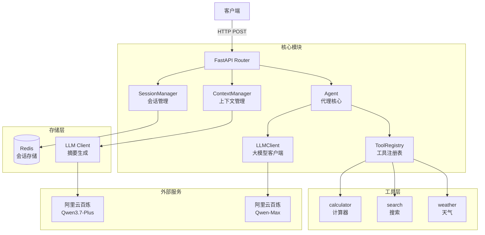
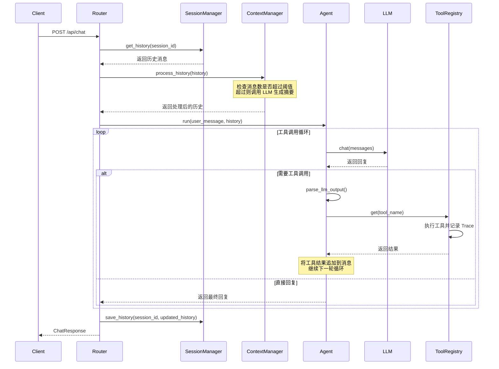

# Mini Agent

一个基于 FastAPI 的轻量级 AI Agent 系统，支持工具调用、会话记忆和上下文管理。

## 项目特点

- 基于 FastAPI 的异步高性能架构
- 可扩展的工具注册系统（计算器、搜索、天气查询）
- Redis 会话持久化
- 智能上下文摘要管理（自动压缩长对话历史）
- 支持多轮工具调用循环

## 系统架构



## 项目结构

```
mini_agent/
├── main.py                 # FastAPI 入口
├── agent/
│   └── agent.py           # Agent 核心逻辑
├── core/
│   ├── config.py          # 配置管理
│   ├── context.py         # 上下文摘要管理
│   └── session.py         # Redis 会话管理
├── llm/
│   └── client.py          # 大模型 API 客户端
├── routers/
│   └── chat.py            # 聊天 API 路由
├── schemas/
│   └── chat.py            # 请求/响应数据模型
├── tools/
│   ├── registry.py        # 工具注册表和装饰器
│   ├── calculator.py      # 计算器工具
│   ├── search.py          # 搜索工具
│   └── weather.py         # 天气查询工具
├── test/
│   ├── test_agent.py      # Agent 单元测试
│   ├── test_context.py    # 上下文管理测试
│   ├── test_session.py    # 会话管理测试
│   └── test_tools.py      # 工具测试
├── pyproject.toml         # 项目依赖配置
└── .env                   # 环境变量配置
```

## 运行方式

### 1. 环境要求

- Python >= 3.14
- Redis 服务（默认 `redis://localhost:6379`）

### 2. 安装依赖

```bash
# 使用 uv 安装（推荐）
uv sync

# 或使用 pip
pip install -e .
```

### 3. 配置环境变量

在项目根目录创建 `.env` 文件：

```env
# 阿里云百炼 API 配置
DASHSCOPE_API_KEY=your_api_key
DASHSCOPE_BASE_URL=https://your-endpoint.cn-beijing.maas.aliyuncs.com/compatible-mode/v1

# 主模型（用于 Agent 对话）
MODEL=qwen-max

# 摘要模型（用于上下文压缩）
MODEL_SUMMARY=qwen3.7-plus

# Redis 连接
REDIS_URL=redis://localhost:6379
```

### 4. 启动服务

```bash
uvicorn main:app --reload
```

服务将在 `http://127.0.0.1:8000` 启动。

### 5. 测试 API

```bash
curl -X POST http://127.0.0.1:8000/api/chat \
  -H "Content-Type: application/json" \
  -d '{"message": "你好", "session_id": "test_session"}'
```

## 系统设计详解

### 核心数据流



### 代理循环机制

Agent 采用 **ReAct (Reasoning + Acting)** 模式，核心循环逻辑在 `agent/agent.py` 中实现：

1. **消息构建**：将系统提示 + 历史消息 + 当前用户消息组装成 `messages` 列表
2. **LLM 调用**：发送消息给大模型，获取回复
3. **解析回复**：使用 `parse_llm_output()` 解析 XML 格式的工具调用
4. **执行分支**：
   - 如果是直接回复（`type: answer`）返回结果
   - 如果是工具调用（`type: tool_call`）执行工具，将结果追加到消息列表，继续循环
5. **失败保护**：连续失败超过 `MAX_FAILURES`（默认 3 次）时终止循环

## Memory（会话记忆）说明

### 会话管理（SessionManager）

**存储位置**：`core/session.py`

**存储后端**：Redis

**数据结构**：JSON 序列化的消息列表

```json
[
  {"role": "user", "content": "你好"},
  {"role": "assistant", "content": "你好！有什么可以帮你的吗？"},
  {"role": "user", "content": "1+1等于多少"},
  {"role": "assistant", "content": "<tool_call>...</tool_call>"},
  {"role": "user", "content": "工具调用结果：\n1+1 = 2"},
  {"role": "assistant", "content": "1+1等于2"}
]
```

**关键参数**：
- **TTL（生存时间）**：86400 秒（24 小时），自动过期清理
- **存储键格式**：`session:{session_id}`

### 上下文管理（ContextManager）

**存储位置**：`core/context.py`

**问题背景**：随着对话轮数增加，发送给 LLM 的 token 数会快速增长，导致：
- API 成本增加
- 可能超出模型上下文窗口限制
- 响应变慢

**解决方案**：自动摘要压缩

**召回时机**：

```
当用户消息数（不含工具调用结果）超过 MAX_ROUNDS（默认 5）时触发摘要
```

**计算逻辑**：

```python
# 工具调用结果不计入用户消息数
user_msg_count = sum(1 for m in history if m.role == "user" and not 是工具结果)

if user_msg_count > MAX_ROUNDS:
    # 摘要位置：保留最近 KEEP_ROUNDS（2）轮对话
    split_point = (MAX_ROUNDS - KEEP_ROUNDS) * 2  # = 6
    
    # 将消息分为两部分：
    to_summarize = history[:split_point]    # 需要摘要的部分
    remaining = history[split_point:]       # 直接保留的部分
    
    # 生成摘要
    summary = await _summarize(to_summarize)
    
    # 拼接结果：[摘要消息] + [保留的消息]
    return [{"role": "system", "content": f"[摘要] {summary}"}] + remaining
```

**放置方式**：

- 摘要消息以 `system` 角色插入到消息列表**最前面**
- 格式：`[摘要] {摘要内容}`
- 如果已存在旧摘要，会被**替换**（不是追加）
- 摘要内容会自动过期（随会话 TTL 一起过期）

**示例**：

```
原始历史（6 轮对话，12 条消息）：
[问题1, 回答1, 问题2, 回答2, 问题3, 回答3, 问题4, 回答4, 问题5, 回答5, 问题6, 回答6]

触发摘要后（保留最近 2 轮）：
[
  {"role": "system", "content": "[摘要] 用户询问了4个问题..."},
  问题5, 回答5, 问题6, 回答6
]
```

## 工具系统

### 工具注册机制

工具通过 `@tool` 装饰器自动注册到 `ToolRegistry`：

```python
from tools.registry import tool, registry

@tool
def calculator(expression: str) -> str:
    """
    计算数学表达式，支持加减乘除
    Args:
        expression: 数学表达式字符串
    """
    result = eval(expression)
    return f"{expression} = {result}"
```

### 工具调用格式

大模型需要以 XML 格式输出工具调用：

```xml
<tool_call>
{"tool": "工具名称", "args": {"参数名": "参数值"}}
</tool_call>
```

### 已注册工具

| 工具名 | 功能 | 参数 | 示例 |
|--------|------|------|------|
| `calculator` | 数学计算 | `expression`: 表达式 | `1+1`, `2*4`, `3*(2+4)` |
| `search` | 搜索信息 | `query`: 关键词 | `"Python教程"`, `"今日新闻"` |
| `weather` | 查询天气 | `location`: 地区 | `"北京"`, `"上海"` |

### 工具追踪

每次工具调用都会记录 `ToolCall` 追踪信息：

```python
@dataclass
class ToolCall:
    tool_name: str    # 工具名称
    args: dict        # 调用参数
    result: str       # 执行结果
    success: bool     # 是否成功
```

追踪信息通过 API 响应返回，便于调试和日志记录。

## API 文档

### POST /api/chat

发送聊天消息并与 Agent 交互。

**请求体**：

```json
{
  "message": "用户消息内容",
  "session_id": "会话唯一标识"
}
```

**响应体**：

```json
{
  "reply": "Agent 的最终回复",
  "tool_trace": [
    {
      "tool_name": "calculator",
      "args": {"expression": "1+1"},
      "result": "1+1 = 2",
      "success": true
    }
  ]
}
```

**错误响应**：

```json
{
  "detail": "错误信息"
}
```

## 测试

### 运行测试

```bash
pytest test/
```

### 测试覆盖

- **test_agent.py**：Agent 核心循环、工具调用、空回复处理、失败保护
- **test_context.py**：上下文摘要触发、摘要替换、工具结果过滤
- **test_session.py**：会话存储、加载、删除、持久化
- **test_tools.py**：计算器、搜索、天气工具的功能测试

## 技术栈

- **Web 框架**：FastAPI
- **异步 HTTP**：OpenAI SDK（AsyncOpenAI）
- **会话存储**：Redis（redis-py async）
- **大模型**：阿里云百炼（Qwen-Max / Qwen3.7-Plus）
- **数据验证**：Pydantic
- **测试框架**：pytest + pytest-asyncio
- **包管理**：uv

## License

MIT
